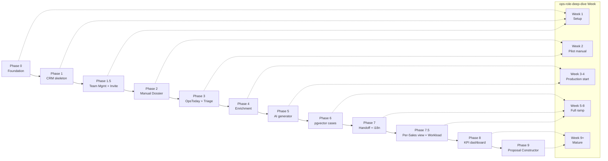

# 2mb CRM Roadmap

Phased technical roadmap for the 2mb CRM (Ops + Sales). Domain first principles in [`ops-role-deep-dive.md`](ops-role-deep-dive.md). Tactical backlog (numbered items) in [`BACKLOG.md`](BACKLOG.md). Project conventions in [`AGENTS.md`](AGENTS.md) and `.cursor/rules/`.

## How to read this file

- **8 phases** (Phase 0 → Phase 8). Each phase is an independently shippable slice — at the end of each one, Ops can use the product in a more capable mode than before.
- Each phase has: **Goal**, **Deliverable** (what Ops can do after the phase), **Tasks** (with `BACKLOG #` references for traceability), **Out of scope** (what is consciously deferred), **Done when** (observable gate to move to the next phase).
- `BACKLOG.md` is **not** rewritten — it stays as the line-item list. Roadmap items reference its numbers.

## Главный принцип фазирования

Manual-first, как в [`ops-role-deep-dive.md`](ops-role-deep-dive.md) (Day 6–7: «5 Dossier'ов вручную, без AI, чтобы понять структуру»):

1. Сначала система должна работать **руками** — Ops добавляет Prospect, ведёт его по pipeline, пишет Dossier вручную, отдаёт Sales.
2. Только после этого подключаются enrichment + AI **поверх** уже работающего UI.
3. Каждая фаза — самостоятельный shippable срез, после которого Ops может реально использовать продукт (пусть и в более ручном режиме).

## Mapping to the ops-role-deep-dive ramp-up

## Phase summary table

| # | Phase | Maps to deep-dive | Primary BACKLOG items |
| --- | --- | --- | --- |
| 0 | Foundation (data + auth) | Week 1 setup days 1–4 | #1, #2, #6 |
| 1 | CRM skeleton (Prospect pipeline) | Week 1 setup day 5 + Week 3 production start | #3, #15 |
| 1.5 | Team Management + Invite flow | Week 1 setup day 1 (team setup) | #40 |
| 2 | Manual Dossier UI (10 sections) | Week 2 day 6–7 manual baseline | #5 |
| 3 | OpsToday + Triage + Triggers | Week 2 day 8–10 calibration | #4 |
| 4 | Enrichment foundation (Apollo / Browse.ai / News / Wayback) | Week 3–4 production start | #11, #12 |
| 5 | AI Dossier generator | Week 3–4 production start | #13 |
| 6 | Cases library + pgvector (Section 8) | Week 5–8 full ramp | #10 |
| 7 | Sales handoff side-effects + cleanup | Week 5–8 full ramp | #5, #14, #16, #17, #18, #32, #7 |
| 7.5 | Per-Sales view + Workload balancing | Week 5–8 full ramp | #41 |
| 8 | KPI dashboard + production gate | Week 9+ mature | (new) |
| 9 | Proposal Constructor (MVP) | Week 9+ mature, deep-dive «вторичные артефакты» | #42 |

---

## Phase 0 — Foundation (data + auth, без видимого UI)

- **Goal:** реальный Supabase backend под капотом, mock router пока остаётся для UI.
- **Deliverable:** `npm run build` проходит; `list_migrations` показывает 11 таблиц + RLS; founder может вручную через Supabase Studio создать пользователя с ролью.
- **Tasks:**
  - Drizzle schema на 11 таблиц в `src/lib/db/schema/` (BACKLOG #1) — `accounts, contacts, prospects, triggers, dossiers, dossier_versions, activities, tasks, playbooks, enrichment_cache, enrichment_jobs`. Источник истины — [`.cursor/rules/crm-domain.mdc`](.cursor/rules/crm-domain.mdc).
  - Миграции через `drizzle-kit generate` → Supabase MCP `apply_migration`.
  - RLS policies по матрице из [`.cursor/rules/roles-rls.mdc`](.cursor/rules/roles-rls.mdc) (BACKLOG #2).
  - Audit trigger на `prospects.{stage, owner_id, priority, lost_reason}` → `activities`.
  - Auth swap mock → `@supabase/ssr` в `src/providers/AuthProvider.tsx` + `src/stores/authStore.ts` (BACKLOG #6). Сохраняем surface `useAuth()`, чтобы UI не сломался.
  - **`src/middleware.ts`** — `@supabase/ssr` middleware refresh-ит сессию и блокирует unauthenticated доступ ко всем `app/(dashboard)/*` маршрутам (302 → `/login`). Публичные: `(auth)/*`, `legal/*`, `/api/inbound`, `/api/health`. Без этого middleware RLS защищает только данные, но не сам UI route.
- **Out of scope:** UI редизайн, новые экраны.
- **Done when:**
  - Supabase MCP `list_migrations` возвращает все 11 таблиц + RLS.
  - Реальный пользователь Supabase логинится через UI и видит mock-данные (UI ещё не переключён на реальные tables — это Phase 1).
  - `npm run build` зелёный, типы Drizzle совпадают со схемой в БД.
  - GET `/leads` (или любой `(dashboard)` route) без cookie → 302 на `/login` от middleware.
  - Истёкшая сессия → middleware silent-refresh через Supabase, без 401 для пользователя.

## Phase 1 — CRM Skeleton (Prospect pipeline руками)

- **Goal:** Ops может вручную добавить Prospect, видеть его в Kanban, перетаскивать между 10 stage-ами.
- **Deliverable:** на `/prospects` 10-колоночный Kanban; на `/prospects/[id]` — header (account, trigger, stage, owner) без секций dossier ещё.
- **Tasks:**
  - Rename `src/features/leads` → `src/features/prospects`, `src/views/Leads*` → `Prospects*`, перерисовать типы `Lead` → `Prospect` (BACKLOG #3). Дроп `computedScores`, `surveyId`, `surveyTitle`, `respondent*`, `answers`.
  - Перерисовать [`src/stores/leadStore.ts`](src/stores/leadStore.ts) на Supabase reads через серверные actions, оставить Zustand только для UI-state (фильтры, выбор).
  - API routes: `app/api/prospects/route.ts` (GET/POST), `app/api/prospects/[id]/route.ts` (GET/PATCH).
  - Pipeline transitions в `src/lib/pipeline/transitions.ts` — guards (например, в `dossier_ready` нельзя без `dossier.status='ready'`).
  - Pipeline Kanban с `@dnd-kit/sortable` (BACKLOG #15) — drag → optimistic update + transition guard + автоматическая запись `Activity`.
  - Удалить `src/mocks/router.ts` пути для leads (или оставить только за feature flag).
- **Out of scope:** Dossier UI (Phase 2), enrichment, AI.
- **Done when:**
  - Ops создаёт Prospect руками через форму, видит карточку в колонке `new`.
  - Drag из `new` → `triaged` пишет `Activity` через Postgres trigger.
  - Попытка drag в `dossier_ready` без готового Dossier — заблокирована UI + API guard.
  - Реальная авторизация: `sales_de` видит только **назначенные ему** (`owner_id`) DE-prospects; аналогично UK для `sales_uk` (нет общего пула по территории).

## Phase 1.5 — Team Management + Invite flow

- **Goal:** founder/admin может через UI пригласить sales-человека, выставить роль/территорию, deactivate. Закрытая регистрация — только по invite.
- **Deliverable:** `/settings/team` с таблицей seats; invite по email через Supabase Admin API; reassign owner UI на странице prospect; открытая `/register` запирается за invite token.
- **Tasks:**
  - `app/(dashboard)/settings/team/page.tsx` — таблица users (Supabase `auth.admin.listUsers`): email, name, role, territory, last_sign_in, status (active/invited/deactivated). Только founder/admin видят.
  - Server action `inviteSeat({ email, role, territory })` → `supabase.auth.admin.inviteUserByEmail` + установка `raw_app_meta_data.role` и `raw_app_meta_data.territory` (см. [`.cursor/rules/roles-rls.mdc`](.cursor/rules/roles-rls.mdc)).
  - Onboarding `app/(auth)/auth/accept-invite/page.tsx` — установить пароль, заполнить display_name, accept terms.
  - Закрытая регистрация: `app/(auth)/register/page.tsx` либо удалить, либо редиректить на `/login` если в URL нет валидного invite token (Supabase `verifyOtp` с типом `invite`).
  - Reassign owner UI на `/prospects/[id]`: combobox с available owners, доступен только founder/ops/admin (RLS уже разрешает). Меняет `owner_id` → audit trigger пишет `Activity`.
  - Deactivate: server action ставит `auth.admin.updateUserById({ ban_duration: 'none' })` или custom flag `users.deactivated_at`. Deactivated user остаётся в `activities` для аудита, но `auth.uid()` не проходит RLS (логин запрещён).
  - i18n DE/EN ключи для нового UI.
- **Out of scope:** SAML/SSO, MFA, password policy customization, self-service signup.
- **Done when:**
  - Founder отправляет invite → `sales_de` получает email, проходит accept-invite, видит только **свои** назначенные DE-prospects.
  - Reassign DE prospect от `sales_de_a` → `sales_de_b` пишет 1 строку в `activities` через trigger.
  - GET `/register` без invite token → 302 на `/login`.
  - Deactivated seat не может залогиниться, но его старые activities видны в audit.

## Phase 2 — Manual Dossier UI (10 секций, без AI)

- **Goal:** Ops может прожить Day 6–7 из deep-dive — написать руками 5 baseline Dossier'ов.
- **Deliverable:** на `/prospects/[id]` 10 collapsible секций по [`.cursor/rules/dossier.mdc`](.cursor/rules/dossier.mdc); каждая редактируется inline; кнопка «Mark ready» гасится до прохождения checklist.
- **Tasks:**
  - `src/features/dossiers/` — компоненты `DossierSection`, `DossierEditor`, `QualityChecklist`.
  - 10 секций со схемой Zod в `src/lib/dossiers/schema.ts` (`snapshot, what_they_do, signals, decision_makers, tech_clues, competitive, hooks, cases, risks, next_step`).
  - `validateDossier(d): QualityResult` в `src/lib/dossiers/validate.ts` — реализация 6 пунктов из [`.cursor/rules/dossier.mdc`](.cursor/rules/dossier.mdc) Quality Checklist.
  - Версионирование: на каждое сохранение → запись в `dossier_versions(dossier_id, version, sections_diff jsonb, generated_at, generated_by)`.
  - `Activity timeline` справа + `Tasks` снизу на странице prospect (read-only сначала, write в Phase 3).
  - i18n DE/EN ключи для всех новых строк.
- **Out of scope:** AI draft, enrichment auto-fill, top-3 cases (Phase 6).
- **Done when:**
  - Ops может за <60 мин вручную заполнить все 10 секций dossier и нажать «Mark ready» только если checklist 6/6.
  - Каждое сохранение bump-ит `dossiers.version` и пишет diff в `dossier_versions`.
  - 5 baseline Dossier'ов реально созданы (Day 6–7 deep-dive baseline) — это вход в Phase 5 как few-shot examples.

## Phase 3 — OpsToday + Triage + Triggers

- **Goal:** Ops открывает приложение в 9:00 и сразу видит, что делать сегодня (см. «Дневная рутина» в deep-dive).
- **Deliverable:** на `/` экран `OpsTodayPage` с тремя зонами: Triage queue, Dossier review queue, KPI cards. Триггеры можно добавлять руками (URL + текст).
- **Tasks:**
  - `OpsTodayPage` (BACKLOG #4) — три списка + 4 KPI карточки (dossiers/day, time-to-ready, opt-out rate, placeholder вместо AI cost пока).
  - `src/features/triggers/` + `app/api/triggers/route.ts` — добавить trigger вручную, привязать к существующему или новому Account.
  - Triage flow: `prospect.new` → `triaged` с обязательным `triage_decision` (`accept`/`reject` + `reject_reason`).
  - Endpoint `app/api/inbound/route.ts` для inbound-формы и Calendly webhook (создаёт `prospect` со source).
  - Tasks CRUD на странице prospect (assignee, due_at).
- **Out of scope:** автоматический сбор триггеров (RSS/News) — в Phase 4 как часть enrichment.
- **Done when:**
  - На `/` Ops видит ровно те Prospect-ы, которые требуют его внимания сегодня (triage + review queues).
  - KPI «Dossiers ready today» обновляется реально из БД.
  - Inbound POST `/api/inbound` создаёт `prospect.new` с правильным `source` и попадает в Triage queue.

## Phase 4 — Enrichment foundation (Apollo → Browse.ai → News/Wayback)

- **Goal:** при переходе `triaged → enriching` автоматически тянутся контакты, firmographics, project page audit, news. Заполняют draft-секции dossier.
- **Deliverable:** Ops триажит → жмёт «Enrich» → через ~30 сек draft-секции 1, 3, 4, 5, 6 уже наполнены данными; счётчик квоты в UI.
- **Tasks:**
  - `enrichment_cache` + `enrichment_jobs` уже в Phase 0; добавить `provider_quota` table.
  - `src/lib/enrichment/apollo.ts` — `fetchOrCache(input)` по правилам из [`.cursor/rules/enrichment.mdc`](.cursor/rules/enrichment.mdc) (BACKLOG #11). TTL 30d, sha256 query_hash.
  - `src/lib/enrichment/browseai.ts` (BACKLOG #12) — TTL 7d, fallback на простой `fetch + cheerio`.
  - `src/lib/enrichment/news.ts` (NewsAPI, TTL 24h), `src/lib/enrichment/wayback.ts` (TTL 30d, sleep 1s).
  - Edge Function `supabase/functions/enrich-prospect/` — оркестратор fan-out, идемпотентен через `enrichment_jobs.job_key`.
  - UI quota counter на `OpsTodayPage` («Apollo: 12 of 100 today»).
  - Auto-stamp `contacts.source_provider`, `contacts.source_fetched_at`. Уважать `opt_out_at` в RLS.
- **Out of scope:** PhantomBuster (отложить, требует осторожной работы с LinkedIn — см. Risk 3 в deep-dive), Hunter.io fallback.
- **Done when:**
  - 1 prospect полностью прошёл fan-out: Apollo + Browse.ai + News + Wayback, все 4 cache rows записаны.
  - Повторный запуск enrichment на том же prospect-е не делает ни одного внешнего вызова (cache hit на всех).
  - UI показывает квоты по каждому провайдеру с цветовым индикатором (>80% жёлтый, >100% красный).
  - Opted-out контакт не появляется в `contacts` после refetch.

## Phase 5 — AI Dossier generator

- **Goal:** при переходе `enriching → dossier_in_progress` AI пишет draft по `grounding` из `enrichment_cache`. Ops только ревьюит.
- **Deliverable:** Edge Function `generate-dossier` создаёт draft-версию dossier; UI показывает версию + ai_metadata (tokens, cost).
- **Tasks:**
  - `npm i @anthropic-ai/sdk` (нет в `package.json` сейчас).
  - `src/lib/ai/llm.ts` — провайдер-абстракция, default Claude Sonnet 4, env `AI_PROVIDER` (см. [`.cursor/rules/ai-prompting.mdc`](.cursor/rules/ai-prompting.mdc)).
  - `src/lib/ai/prompts/v1/dossier_master.md` с frontmatter (`id, version, model, temperature`) + few-shot из 3 baseline manual Dossier'ов (созданных в Phase 2) → `src/lib/ai/examples/`.
  - `src/lib/ai/grounding.ts` — нормализатор payload-ов из `enrichment_cache` в единый JSON для prompt.
  - `validateDossier` расширяется: anti-fabrication — стрипает любые имена/URL/числа, отсутствующие в `grounding`.
  - Edge Function `supabase/functions/generate-dossier/` (BACKLOG #13). Логирует в `dossiers.ai_metadata` (model, tokens_in/out, cost_usd, latency_ms, prompt_version).
  - Кнопка «Regenerate» в UI bumps `dossiers.version`, пишет diff в `dossier_versions`.
- **Out of scope:** sub-prompts по секциям (только если master prompt будет давать мусор — A/B решение в Phase 6).
- **Done when:**
  - 5 prospects подряд проходят пайплайн `enrich → AI draft → human review → ready` без падений Edge Function.
  - 0 ungrounded fact-ов в финальном dossier (validate сам стрипает).
  - `dossiers.ai_metadata` содержит честные tokens/cost для каждого dossier.
  - Time-to-Dossier (от Triage до `dossier_ready`) <30 минут wall-clock — target Day 10 deep-dive.

## Phase 6 — Cases library + pgvector (Section 8)

- **Goal:** Section 8 dossier («Comparable 2mb cases») перестаёт быть пустой/ручной — auto-top-3 по vector similarity.
- **Deliverable:** при генерации dossier prompt получает top-3 cases с обоснованием.
- **Tasks:**
  - Включить `pgvector` extension в `2mb` (через MCP `apply_migration`).
  - Schema: `cases(id, name, scale_units, type, style, region, year, summary, pdf_url, ...)` + `cases_embeddings(case_id, vector vector(1536))`.
  - Импорт 49 baseline cases (BACKLOG #10) из исходных данных 2mb (CSV или ручной seed).
  - `src/lib/ai/embeddings.ts` — вызов `text-embedding-3-large` или Claude embedding API.
  - `src/lib/dossiers/match-cases.ts` — semantic search top-5 → re-rank по metadata (region, type, scale) → top-3.
  - В Phase 5 master prompt принимает `top_cases` отдельным полем.
- **Out of scope:** UI каталога cases, ручной upload новых cases (можно через Supabase Studio пока).
- **Done when:**
  - 49 cases embedded и доступны через semantic search.
  - Smoke-test query «65 unit residential modern facade Berlin» возвращает top-3 cases с similarity ≥ 0.7.
  - Section 8 в свежегенерируемом dossier содержит реальные cases (не placeholder).
  - Cases relevance score (Sales rating, Phase 8 KPI) ≥ 4.0/5 после первой недели.

## Phase 7 — Sales handoff side-effects + cleanup

- **Goal:** transition `dossier_in_progress → dossier_ready` запускает все автоматические побочные эффекты для Sales.
- **Deliverable:** при «Mark ready» Sales-человек по территории получает уведомление + автоматически создаётся первая задача.
- **Tasks:**
  - Auto-assign по territory: `DE → sales_de`, `UK → sales_uk`, `EU_other → ops` (см. [`.cursor/rules/crm-domain.mdc`](.cursor/rules/crm-domain.mdc)).
  - Slack incoming-webhook (env `SLACK_WEBHOOK_URL`) или in-app notification record.
  - Auto-create `Task`: `«1st touch — [Company]»`, due_at = now + 24h, playbook id из `dossier.suggested_playbook_id`.
  - Playbook picker UI на странице prospect (BACKLOG #5 финал).
  - i18n parity check `npm run check-i18n` (BACKLOG #14) — fail build если ключи разъезжаются.
  - Чистка остатков survey-эры: BACKLOG #16 (молекулы/организмы), #17 (i18n keys), #18 (`src/lib/constants.ts`). Brand sweep #32 (oprosnik/proscus → 2mb-crm) — ✅ выполнено в Phase 1.6.
  - Удалить `_tmp_design_system_LOCKED/` (BACKLOG #7) после рестарта.
- **Out of scope:** автоматическая рассылка email через Smartlead (Sales делает руками вне CRM пока).
- **Done when:**
  - DE Prospect стал `dossier_ready` и **назначен** `sales_de` → получил Slack в течение 5 сек, видит prospect в списке, Task с due_at = +24h.
  - `npm run check-i18n` зелёный.
  - В коде нет ни одного `survey` упоминания вне legacy-папок (grep clean). Brand cleanup `oprosnik`/`proscus` уже выполнен в Phase 1.6.
  - `_tmp_design_system_LOCKED/` удалён.

## Phase 7.5 — Per-Sales view + Workload balancing

- **Goal:** founder/ops может открыть конкретного Sales и увидеть его pipeline, активность и KPI. Auto-assign балансирует нагрузку между несколькими seats в одной территории.
- **Deliverable:** `/team/[user_id]` с тремя вкладками (Pipeline / Activity / KPI); round-robin в auto-assign hook (Phase 7), когда в territory >1 active seat.
- **Tasks:**
  - `app/(dashboard)/team/[user_id]/page.tsx` — header (display_name, role, territory, last_sign_in), 3 tabs.
  - **Pipeline tab:** тот же Kanban, что на `/prospects`, но prefiltered `owner_id = user_id`. Founder/ops может drag между stages здесь же.
  - **Activity tab:** последние 100 строк из `activities` где `actor_id = user_id` или `prospect.owner_id = user_id`. Группировка по дню. Фильтры: type (call/email/stage_change/note).
  - **KPI tab:** weekly aggregates за последние 12 недель — calls_logged, emails_sent, meetings_scheduled, won, lost, avg_dossier_quality_score (выставленный этим Sales). Линейный график + текущая неделя жирным.
  - `src/lib/team/workload.ts` — `getActiveLoad(userId)` возвращает count open prospects (stage in `1st_call..proposal_sent`).
  - Обновить auto-assign hook (Phase 7): при transition `dossier_in_progress → dossier_ready` для DE territory — если активных `sales_de` seats >1, выбираем seat с наименьшим `getActiveLoad`. Tiebreak — random.
  - `/team/index` — список всех seats с их current load (для founder).
  - RLS: founder/ops/admin видят `/team/*` целиком; sales видит только свою страницу `/team/[self.id]`.
- **Out of scope:** time tracking, screen recording, любая HR-функциональность, presence (online/offline) — отложить.
- **Done when:**
  - Founder открывает `/team` → видит всех seats + ops + их load (DE: A=12 / B=9, UK: 7).
  - Клик на `sales_de_a` → видит pipeline 12 prospects, activity feed за неделю с группировкой, KPI график за 12 недель.
  - Round-robin: 5 dossier_ready подряд для DE → распределяются ~3/2 между двумя DE seats, не все одному.
  - `sales_uk` пытается открыть `/team/sales_de_a/id` → 403 от RLS.

## Phase 8 — KPI dashboard + production gate

- **Goal:** founder открывает экран и видит еженедельный дашборд из секции «KPI Ops» в deep-dive (строки 559–608).
- **Deliverable:** `/dashboard` (или `/founder`) с секциями Production volume, Quality, Pipeline health, Tools/cost.
- **Tasks:**
  - Daily Cron `supabase/functions/cron-roll-ai-usage/` → `ai_usage_daily(date, model, total_tokens_in/out, total_cost_usd)`.
  - View или materialized view `pipeline_health` (count prospects по stage, конверсии stage→stage за неделю).
  - `dossier_quality_score` — Sales выставляет 1–5 по 4 критериям после звонка, average считается.
  - UI: 4 секции карточек, weekly default + переключатель периода.
  - `provider_quota` сводка («Apollo this month: 230 / 500», «Browse.ai: 45 / 250»).
  - **Backup verification:** убедиться, что Supabase managed backups + PITR (Point-in-Time Recovery) включены на проекте `2mb`; задокументировать процедуру restore (timing, кто инициирует, smoke-test после restore). Без этого «production gate» — пустой ярлык.
- **Out of scope:** custom in-product analytics (deep-dive прямо говорит, что это out of scope для MVP).
- **Done when:**
  - Founder видит реальные числа из БД, совпадающие с manual count.
  - Conversion `Dossier → Conversation` (Section 3 deep-dive KPI) считается за неделю.
  - Quality average score обновляется после каждого Sales rating без ручного refresh.
  - Cost-this-month совпадает с цифрой из Anthropic + Apollo billing console (±5%).
  - PITR включён, restore-процедура задокументирована, выполнен dry-run «откатить prod на 1 час назад в staging» — успешно.

## Phase 9 — Proposal Constructor (MVP)

- **Goal:** Sales (или Ops для меньших сделок) может из карточки prospect собрать визуально красивый proposal из готовых блоков, добавить картинки, экспортировать в PDF. Это закрывает «вторичный артефакт Proposal'ы» из [`ops-role-deep-dive.md`](ops-role-deep-dive.md) (строки 89, 261, 553) внутри CRM, без зависимости от внешнего PandaDoc.
- **Deliverable:** `/prospects/[id]/proposal` — блочный редактор; библиотека из 5–7 шаблонных блоков; image upload в Supabase Storage; экспорт в PDF; версионирование.
- **Tasks:**
  - **Schema (новая миграция):**
    - `proposals(id, prospect_id fk, version int, title text, blocks jsonb, status enum [draft, sent, accepted, rejected], language enum [de, en], created_by, created_at, updated_at)`
    - `proposal_versions(proposal_id, version, blocks_diff jsonb, generated_at, generated_by)` — как у dossier.
    - RLS: `founder/admin` rw all; `ops` rw; `sales_de` rw на proposals для DE prospects; `sales_uk` то же для UK.
  - **Storage:** bucket `proposals-media` в Supabase Storage. RLS policy: read только если `auth.uid()` имеет доступ к parent prospect через RLS на `proposals`. Max 10MB на файл, разрешённые типы — `image/jpeg, image/png, image/webp, application/pdf`.
  - **Block library** в `src/lib/proposals/blocks/` — каждый блок это TS тип + Zod schema + React renderer + React editor:
    - `cover` — title, subtitle, hero image, client logo, date.
    - `about_2mb` — короткий о компании + 3 KPI цифры (49 cases / 12 years / 8 countries).
    - `comparable_cases` — 2–3 case-карточки (image + name + 1-line description). Можно тянуть из cases library Phase 6.
    - `project_scope` — bullet list скоупа работ + изображение.
    - `pricing` — таблица: package / deliverables / price (€); опционально 2–3 варианта.
    - `timeline` — milestones (week N → deliverable).
    - `terms` — payment terms, IP, validity, footer.
  - **Editor UI** на `app/(dashboard)/prospects/[id]/proposal/page.tsx`:
    - Левая панель — палитра блоков (drag-to-add).
    - Центр — live preview (тот же React-renderer что в PDF).
    - Правая — props активного блока (text inputs, image upload, repeat-fields через RHF).
    - Top bar — title, language toggle DE/EN, version label, Save / Export PDF.
  - **Drag-reorder** через `@dnd-kit/sortable` (уже в зависимостях).
  - **Image upload:** `<input type=file>` → server action → `supabase.storage.from('proposals-media').upload()` → возвращённый public/signed URL подставляется в `block.props.image_url`.
  - **PDF export:** server-side через `@react-pdf/renderer` (или `puppeteer-core` Edge Function если потребуется CSS-pixel-perfect). Решение об инструменте — A/B по 1 proposal в первую неделю Phase 9. Метаданные PDF: title = `${prospect.account.name} — Proposal v${version}`.
  - **Версионирование:** каждое сохранение bumps `proposals.version` и пишет `blocks_diff` в `proposal_versions`.
  - **i18n DE/EN:** UI редактора + дефолтные тексты блоков на двух языках (Sales выбирает language).
  - Кнопка «Create proposal» на странице prospect — доступна со стадии `proposal_sent` или раньше (decided by Sales).
  - При сохранении первого proposal автоматический stage transition `meeting_scheduled → proposal_sent` (опционально, с подтверждением).
- **Out of scope (отложено в Triggers ниже, не в этой фазе):**
  - Share-ссылка клиенту с view tracking (кто/когда открыл, какие секции смотрел).
  - E-signature (DocuSign / native).
  - AI-assisted block fill (вытащить из dossier → черновик scope/pricing).
  - Brand kit / theming customization (фиксированный 2mb brand на старте).
  - Custom block creation Sales-ом (только встроенные 5–7 блоков).
  - Многоязычные блоки в одном proposal (выбор DE или EN на весь документ).
- **Done when:**
  - Sales создаёт proposal из 5 блоков, загружает 3 изображения, экспортирует PDF за <15 минут wall-clock.
  - PDF выглядит professional: consistent typography (Inter), правильный image sizing, корректные page breaks, полный 2mb brand (логотип, цвета).
  - 5 версий одного proposal видны в UI с diff (как у dossier).
  - Storage RLS: `sales_uk` не видит media из proposals на DE-prospects (curl с UK JWT возвращает 403).
  - i18n: переключение DE↔EN в editor — все UI-строки и дефолтные тексты блоков переключаются.

---

## Cross-cutting concerns (touch every phase)

- **i18n DE/EN parity:** каждая новая UI-строка добавляется в оба файла локалей. Жёсткая проверка появляется в Phase 7 (BACKLOG #14), но дисциплина с Phase 1.
- **RLS first:** ни одна новая таблица не появляется без RLS policy в той же миграции.
- **Cache or fail:** ни один внешний API-вызов не идёт без `enrichment_cache` lookup (Phase 4+).
- **No inline prompts:** AI prompts только в `src/lib/ai/prompts/v{N}/*.md` (Phase 5+).
- **Audit by trigger, not app:** все мутации `prospects.{stage, owner_id, priority, lost_reason}` пишутся в `activities` Postgres-триггером (Phase 0).
- **Service role server-only:** ключ Supabase service role никогда не уходит в браузер (Phase 0+).

## Production Gate Checklist

Phase 8 называется «production gate», но gate — это не дашборд, а проверочный лист перед обещанием SLA. Этот чеклист должен пройти **до** того, как первый внешний клиент / первая реальная сделка заводится в систему.

| Категория | Проверка | Где живёт |
| --- | --- | --- |
| **DB / Data** | Managed backups + PITR включены на `2mb`, restore dry-run пройден | Phase 0 + Phase 8 |
| **DB / Data** | Migration rollback procedure задокументирован (down-скрипт или restore-from-backup) | Phase 0 |
| **Auth** | Middleware блокирует unauthenticated к `(dashboard)` | Phase 0 |
| **Auth** | Закрытая регистрация: `/register` без invite token → 302 на `/login` | Phase 1.5 |
| **Auth** | Service role key только в server-side env, никогда в client bundle | Cross-cutting |
| **Security** | RLS smoke-test: pod-логин под `sales_de` не видит UK prospects (curl + JWT) | Phase 0 |
| **Security** | Rate limits на публичные endpoints (`/api/inbound`, любые webhooks) | Phase 3+ |
| **Observability** | Error tracking (Sentry или эквивалент) активен в production env | Phase 8 |
| **Observability** | AI cost daily-cap alert настроен (если за день потрачено >€X — уведомление в Slack) | Phase 8 |
| **AI** | `validateDossier` стрипает ungrounded facts (smoke-test на 5 dossier) | Phase 5 |
| **End-to-end** | Smoke-test полного flow: добавить trigger → triage → enrich → AI draft → review → ready → handoff Sales → 1st task создан | Phase 0–7 |
| **Legal (DE/UK обязательно)** | Страницы `app/legal/{terms, privacy, impressum, dpa, cookies}` опубликованы и заполнены актуальным текстом | Phase 7 cleanup |
| **Legal** | DPA с Supabase подписан, GDPR records-of-processing заполнены | One-off |
| **Legal** | Cookie banner работает, согласие сохраняется в `cookie_consent` | уже есть в репо |
| **Infra** | Production domain настроен, SSL валиден, DNS-records корректны (CAA, MX если email) | One-off |
| **Infra** | Vercel deployment config (если деплой туда), preview environments для PR | Phase 8 |
| **Operational** | On-call: кто отвечает на errors / алерты, channel в Slack | One-off |
| **Operational** | Initial seed users созданы: founder, ops, sales_de, sales_uk; роли и territories выставлены | Phase 1.5 |
| **Operational** | Runbook для restore + rollback + on-call rotation задокументирован (Notion или `docs/runbook.md`) | One-off |

Gate **не пройден**, если хотя бы одна строка не зелёная. До этого — production-режим только для founder + ops в shadow-режиме (без реальных клиентов).

## Out of scope for the entire roadmap (MVP boundary)

- Public landing page / marketing site.
- Customer-facing webhooks или public API.
- Mobile app.
- Email-sending integration (Smartlead) — Sales работает с email вне CRM.
- PhantomBuster scraping.
- Custom in-product analytics за пределами founder-dashboard counters.
- Custom Slack-app (используется existing incoming-webhook).
- SAML/SSO, MFA, self-service signup (Phase 1.5 закрытая регистрация по invite).
- Proposal share-link клиенту с view tracking, e-signature, AI-assisted proposal blocks, custom block creation Sales-ом, brand kit theming (Phase 9 deliverables — только встроенный 2mb brand + ручное наполнение + PDF export).

## Triggers для расширения за пределы MVP

Из «Когда Ops становится перегруженным» в [`ops-role-deep-dive.md`](ops-role-deep-dive.md):

- 3 недели подряд <8 Dossier/день при full-time Ops → нужна вторая Ops seat в системе (multi-tenant ownership уже есть в Phase 1.5, нужен UI допуск Ops).
- Quality score <3.5 средний 2 недели → вернуться к Phase 5 prompt iteration или Phase 6 case re-tagging.
- Backlog Dossier'ов >40 unprocessed → добавить bulk-actions в `OpsTodayPage`.
- Inbound нагрузка >2 часа/день → отдельный UI-flow для inbound с auto-routing.
- Proposal time >120 мин среднее (deep-dive строка 553) → активировать AI-assisted proposal blocks (читать dossier, заполнять scope/pricing draft) и/или brand kit theming.
- >5 закрытых сделок/мес → активировать share-link клиенту с view tracking (Phase 9 deferred), e-signature.
- 2+ active sales seats в одной территории и нагрузка несбалансирована → Phase 7.5 round-robin недостаточно, добавить explicit reassign rules + skill matching (по сегменту/языку).
- **UK launch с активным tender pipeline** (deep-dive строки 479, 684) → расширить enum `prospect.source` (специализированные UK tender boards), добавить optional поля на prospect: `tender_deadline`, `tender_required_certifications`, `tender_budget_range`, `tender_submission_status`. Структурно tender — это тот же Prospect с другим источником и более длинным циклом, отдельная фаза не нужна; фильтр в Kanban/OpsToday по `source` даёт «tender pipeline view» бесплатно.
